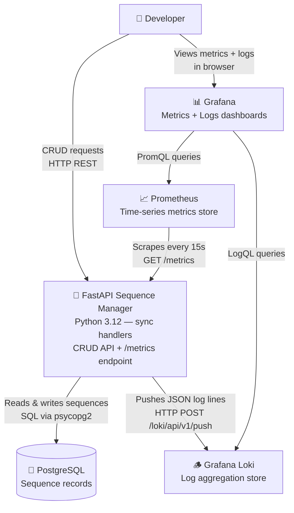
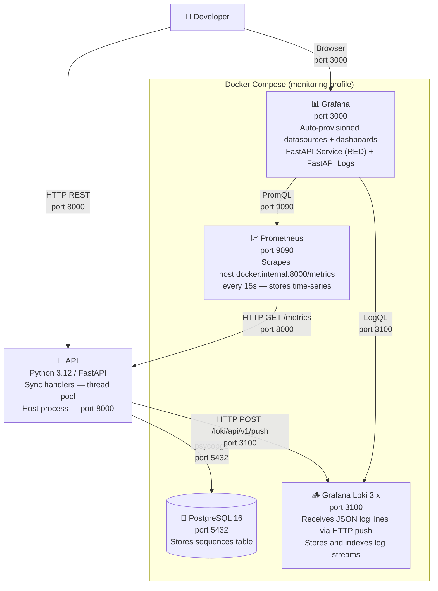
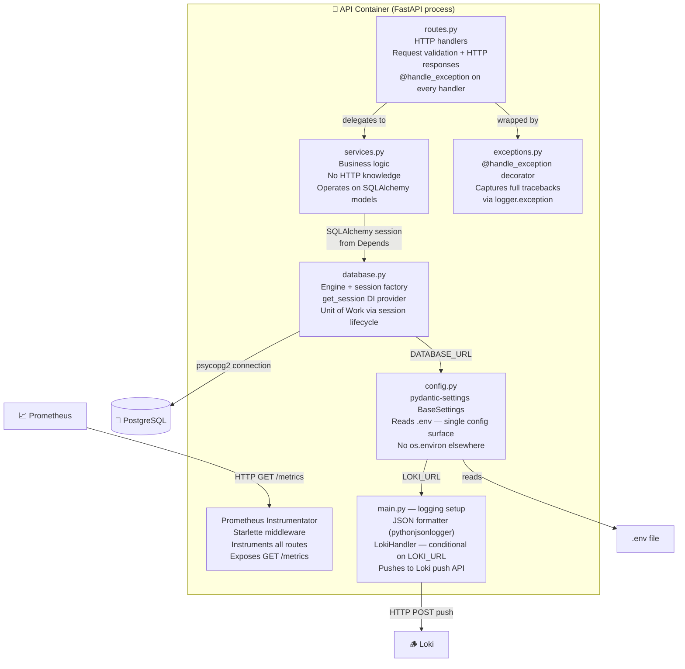

# Architecture Overview

## Overview

This project is a FastAPI-based sequence management service that demonstrates production-grade
patterns for a synchronous Python backend: layered architecture, real-database integration
tests, dependency injection, structured exception handling, and a full observability stack
(Prometheus + Grafana + Loki). It is intentionally kept small so that each pattern is legible
in isolation.

---

## Key Architectural Decisions

### Sync-first handlers (`def`, not `async def`)

Route handlers are plain `def` functions. FastAPI detects this and offloads each request to
its external thread pool (via `anyio`), leaving the event loop free from blocking I/O. This
avoids the common pitfall of accidentally blocking the event loop with synchronous database
calls inside `async def` handlers. The trade-off is that true async I/O (e.g. `asyncpg`) is
not available, but for a PostgreSQL-backed CRUD service the thread-pool approach is simpler
and correct.

### Layered structure: Routes → Services → Database

HTTP handlers in `backend/routes.py` call business logic in `backend/services.py`, which
calls the database. Routes never touch the database directly. This keeps HTTP concerns (status
codes, request/response shapes) separate from business logic and makes services independently
testable.

### Real PostgreSQL in tests via testcontainers

Tests run against a real PostgreSQL container spun up by `testcontainers`. There is no SQLite
fallback and no mocking of the database layer. Each test is wrapped in a transaction that is
rolled back via a savepoint (`join_transaction_mode="create_savepoint"`), giving full
isolation without truncation. This caught real migration issues that SQLite-based tests would
have missed.

### Dependency injection via `get_session`

The SQLAlchemy session lifecycle is managed by the `get_session` dependency, injected with
`Annotated[Session, Depends(get_session)]`. Tests override this dependency via
`app.dependency_overrides` to inject a session bound to the rollback transaction. The
fetch-or-404 pattern is also extracted into a named dependency rather than duplicated across
handlers.

### All config via `backend/config.py`

A `pydantic-settings` `BaseSettings` subclass reads all environment variables (including
`.env`). Nothing in the application reads `os.environ` directly. This makes the config
surface explicit and type-checked.

### Structured JSON logging + Loki log shipping

All log output is formatted as JSON via `python-json-logger` (`pythonjsonlogger.json.JsonFormatter`),
making every log line parseable by LogQL. When `LOKI_URL` is set in the environment, a
`logging_loki.LokiHandler` is added to the root logger at startup, pushing all log lines
directly to the Loki HTTP push API (`/loki/api/v1/push`) tagged with `{application="fastapi"}`.
The handler is initialised conditionally and failures are caught so the app starts cleanly
even without Loki running. This avoids the Promtail Docker socket discovery approach, which
cannot capture logs from a host process.

### Exception handling via `@handle_exception`

All route handlers are decorated with `@handle_exception(logger)` from
`backend/exceptions.py`. This ensures that full tracebacks are captured via
`logger.exception` rather than being swallowed silently, which is critical for observability.

---

## Level 1 — System Context

---

## Level 2 — Containers

> **Docker Compose profiles:** PostgreSQL runs under the default profile (always up).
> Prometheus, Loki, and Grafana run under the `monitoring` profile:
> `docker compose --profile monitoring up -d`

---

## Level 3 — API Components

---

## Data Model

The single table managed by this service:

| Column | Type | Notes |
|--------|------|-------|
| `id` | Integer | Primary key, auto-increment |
| `name` | String | Required |
| `description` | String | Nullable |
| `created_at` | DateTime | Server default `now()`, set by PostgreSQL |

Schema is defined in `backend/models.py` (SQLAlchemy `Mapped` / `mapped_column`) and
managed by Alembic migrations under `alembic/versions/`.
