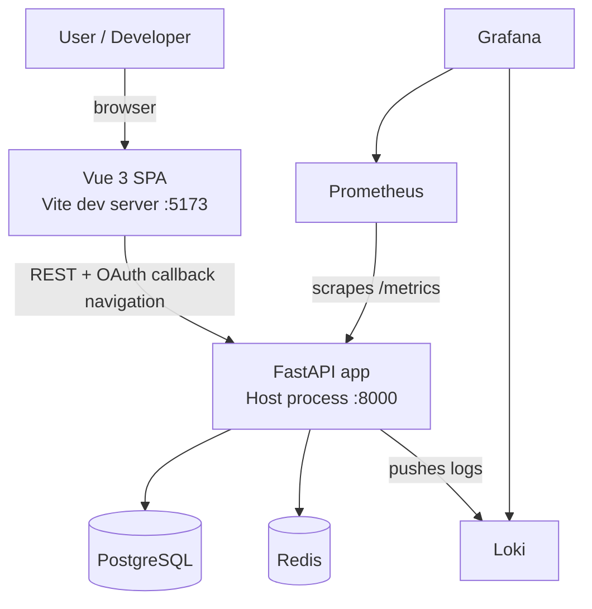

# Architecture Overview

## Overview

This project is a full-stack home automation routines application intended to be
readable as a reference implementation, not just functional as a demo.

The backend is a synchronous FastAPI application with SQLAlchemy, PostgreSQL,
APScheduler, Redis-backed execution coordination, Google OAuth2 login, JWT-based
authorization, structured logging, Prometheus metrics, and a real-database test
suite.

The frontend is a Vue 3 SPA with PrimeVue, Tailwind, Pinia, TanStack Query, an
OpenAPI-backed client contract, MSW-powered component tests, and light
Playwright smoke coverage.

See also:

- [docs/frontend.md](./frontend.md)
- [docs/testing.md](./testing.md)

## Key Architectural Decisions

### Sync-first FastAPI handlers

Route handlers use `def`, not `async def`, so FastAPI runs them in its external
thread pool. That keeps the event loop free from blocking SQLAlchemy and other
synchronous I/O. The repo includes dedicated performance tests to demonstrate
why this matters.

### Layered backend structure

The backend is intentionally split into layers:

- route modules own HTTP concerns
- service modules own business rules and persistence workflows
- schema modules own validation and response contracts
- execution and scheduler modules own routine execution concerns

That keeps the API surface readable and makes correctness fixes less likely to
leak across unrelated concerns.

### Transaction-safe routine updates

Routine schedule updates now validate the merged post-update schedule before
commit, and scheduler registration is part of the same logical update workflow.
This avoids persisting invalid routine state or drifting the database away from
the scheduler's registered jobs.

### Explicit execution boundary

Routine execution is no longer launched ad hoc from the route layer. The backend
now uses an explicit execution boundary in `backend/execution_engine.py`,
centered on `RoutineExecutor` and `BackgroundRoutineLauncher`. Route handlers
delegate to that boundary rather than creating raw threads themselves.

That matters because execution orchestration is now:

- more testable
- easier to substitute
- less coupled to route handlers

### Real PostgreSQL in tests

Backend tests use a real PostgreSQL container via testcontainers. There is no
SQLite compatibility layer. This is deliberate: migrations, JSON behavior, and
transaction handling are part of what the repo is trying to teach.

### Contract-aware frontend testing

The frontend exports the backend OpenAPI schema and generates local TypeScript
types. Those types feed the MSW-backed Vitest layer so frontend assumptions are
checked against the API contract without needing to run the backend for every UI
test.

### Test pyramid with a thick middle

Most confidence comes from backend integration tests and frontend component/
integration tests. Playwright exists, but only as a light browser layer. The
repo is intentionally not built as an E2E-heavy "ice cream cone."

## Runtime Topology



## Backend Components

### API Layer

- `backend/main.py`
  Registers routers, metrics, logging, and scheduler startup/shutdown.
- `backend/auth_routes.py`
  Password-grant token endpoint for local dev and automation.
- `backend/user_routes.py`
  Google OAuth flow plus authenticated user endpoints.
- `backend/routine_routes.py`
  Routines, actions, run-now, and execution history endpoints.

### Domain and Workflow Layer

- `backend/routine_services.py`
  Routine and action business logic, including invariant-preserving updates.
- `backend/execution_engine.py`
  Execution launcher and executor boundary.
- `backend/scheduler.py`
  APScheduler integration for non-manual routines.

### Data and Security Layer

- `backend/models.py`
  SQLAlchemy source of truth for schema shape.
- `backend/schemas.py`
  Pydantic validation and response contracts.
- `backend/database.py`
  SQLAlchemy engine and session lifecycle.
- `backend/security.py`
  JWT creation/verification and write-access dependency.
- `backend/google_oauth.py`
  OAuth redirect URL generation, token exchange, userinfo fetch, and CSRF state validation.
- `backend/redis_client.py`
  Redis integration used by the execution path.

## Frontend Components

### App Shell

- `frontend/src/App.vue`
  Layout shell and router outlet.
- `frontend/src/components/layout/*`
  Navbar and sidebar.

### App State and Transport

- `frontend/src/stores/auth.ts`
  Pinia auth store.
- `frontend/src/api/client.ts`
  Shared API transport layer.
- `frontend/src/api/generated/*`
  Exported OpenAPI contract plus generated TS types.

### Feature Layer

- `frontend/src/features/routines/*`
  Query keys, queries, mutations, page composables, and extracted routine UI components.
- `frontend/src/features/users/*`
  User-list query logic.

### Views

- `frontend/src/views/RoutinesView.vue`
- `frontend/src/views/RoutineDetailView.vue`
- `frontend/src/views/ExecutionHistoryView.vue`
- `frontend/src/views/UsersView.vue`
- `frontend/src/views/LoginView.vue`
- `frontend/src/views/AuthCallbackView.vue`

## Data Model

### `users`

Stores Google-authenticated users.

| Column | Type | Notes |
|---|---|---|
| `id` | Integer PK | Auto-increment |
| `google_id` | String unique | Stable Google identifier |
| `email` | String unique | JWT subject |
| `name` | String | Display name |
| `picture` | String nullable | Avatar URL |
| `created_at` | DateTime | First login timestamp |

### `routines`

Stores routine definitions and their schedule metadata.

| Column | Type | Notes |
|---|---|---|
| `id` | Integer PK | Auto-increment |
| `name` | String | Required |
| `description` | String nullable | Optional |
| `schedule_type` | String | `manual`, `interval`, or `cron` |
| `schedule_config` | JSON nullable | Shape depends on `schedule_type` |
| `is_active` | Boolean | Controls scheduler registration |
| `created_at` | DateTime | Creation timestamp |

### `actions`

Stores ordered routine actions.

| Column | Type | Notes |
|---|---|---|
| `id` | Integer PK | Auto-increment |
| `routine_id` | FK | Parent routine |
| `position` | Integer | Ordered execution slot |
| `action_type` | String | For example `shell`, `webhook`, `delay` |
| `config` | JSON | Action-specific config |

### `routine_executions`

Stores execution history and active-run state.

| Column | Type | Notes |
|---|---|---|
| `id` | Integer PK | Auto-increment |
| `routine_id` | FK | Parent routine |
| `status` | String | `running`, `completed`, `failed` |
| `triggered_by` | String | `manual` or scheduler-originated |
| `started_at` | DateTime | Start timestamp |
| `completed_at` | DateTime nullable | End timestamp |

## Operational Notes

### OAuth callback transport

The backend redirects successful Google logins to:

```text
/auth/callback#token=<jwt>
```

The token is placed in the fragment, not the query string, so it is not sent to
the server during the redirect.

### Single-worker CSRF state store

Google OAuth state is stored in memory. That means the default development mode
must stay single-process unless the state store is moved to shared infrastructure
such as Redis.

### Observability

Prometheus metrics are exposed at `/metrics`. JSON logs are emitted to stdout and
can also be pushed to Loki when `LOKI_URL` is configured. Grafana is pre-wired
to query both Prometheus and Loki.
