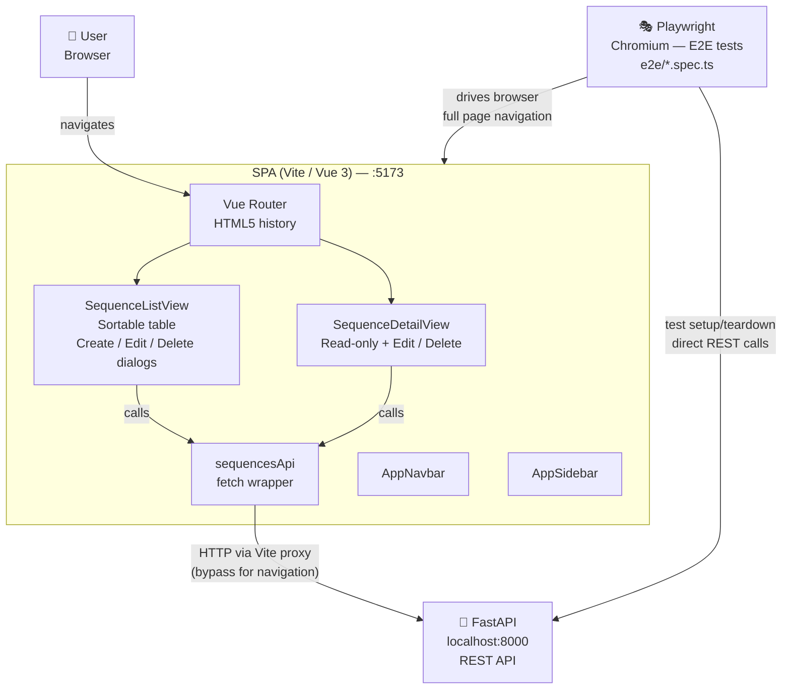

# Frontend Architecture

## Overview

The `frontend/` directory contains a single-page application (SPA) built with
**Vite 8**, **Vue 3**, and **TypeScript**. It communicates exclusively with the
FastAPI backend running on port 8000. PrimeVue is registered in **unstyled mode**
so that all visual styling is owned by the application via **Tailwind CSS v4**.

Two test layers cover the frontend: **Vitest** (unit/component, jsdom, mocked API)
and **Playwright** (browser E2E, real Chromium, real backend). They are deliberately
kept separate — Vitest proves component logic in isolation; Playwright proves the
full frontend ↔ backend integration through an actual browser.

---

## Tech Stack

| Concern | Library | Notes |
|---------|---------|-------|
| Bundler | `vite ^8` | ESM-native, dev-server proxy built in |
| Framework | `vue ^3.5` | Composition API + `<script setup>` |
| Language | TypeScript `~5.9` | Strict mode via `vue-tsc` |
| Component library | `primevue ^4.5` | Unstyled mode — no theme CSS injected |
| Styling | `tailwindcss ^4` | PostCSS via `@tailwindcss/postcss` |
| Routing | `vue-router ^4.6` | HTML5 history mode |
| State | `pinia ^3` | Lightweight store (ready for Phase 2 auth) |
| Unit testing | `vitest ^4` | JSDOM environment, Allure reporter |
| Test utilities | `@vue/test-utils ^2.4` | Component mount helpers |
| Coverage | `@vitest/coverage-v8` | V8 native coverage |
| E2E testing | `@playwright/test ^1.52` | Chromium browser, Page Object Model |
| E2E reporting | `allure-playwright ^3.6` | Allure results to `allure-results-e2e/` |

---

## Key Architectural Decisions

### PrimeVue unstyled mode

PrimeVue is initialised with `{ unstyled: true }`, which disables the library's
built-in CSS. This gives full control over the visual output via Tailwind utility
classes and scoped `<style>` blocks, avoiding the specificity conflicts that arise
when mixing a pre-styled component library with a utility-first CSS framework.

### Vite dev-server proxy → port 8000

All API calls use relative paths (e.g. `/sequences/`). In development, Vite's
`server.proxy` forwards matching requests to `http://localhost:8000`, avoiding
CORS. In production the same relative paths are served from the same origin as
the SPA (or handled by a reverse proxy). No `VITE_API_URL` env var is needed.

The proxy rule includes a `bypass` function: browser navigation requests
(Accept: `text/html`) are served `index.html` so Vue Router handles the route
client-side, while API `fetch` calls (Accept: `application/json`) are forwarded
to the backend. Without this, navigating directly to `/sequences` in a browser —
or in a Playwright test — would return JSON instead of the SPA shell.

### Fetch-based API client (no Axios)

`src/api/sequences.ts` wraps `fetch` in a thin typed helper. This avoids an
extra dependency while remaining straightforward to test — tests stub
`globalThis.fetch` with `vi.stubGlobal` and restore it with `vi.unstubAllGlobals`.

### Native `<dialog>` for modals

Create / Edit / Delete modals use the native HTML `<dialog>` element with
`showModal()` / `close()`. This provides built-in focus-trapping, `::backdrop`
styling, and accessibility semantics without a modal library.

---

## Directory Structure

```
frontend/
├── public/                  # Static assets (favicon, icons)
├── src/
│   ├── __tests__/           # Vitest unit + component tests (jsdom, mocked API)
│   │   ├── api.sequences.test.ts
│   │   ├── types.sequence.test.ts
│   │   ├── SequenceListView.test.ts
│   │   └── SequenceDetailView.test.ts
│   ├── api/
│   │   └── sequences.ts     # Typed fetch wrapper for /sequences endpoints
│   ├── components/
│   │   └── layout/
│   │       ├── AppNavbar.vue    # Top navigation bar
│   │       └── AppSidebar.vue   # Left sidebar (hidden on mobile)
│   ├── router/
│   │   └── index.ts         # Vue Router — HTML5 history
│   ├── types/
│   │   └── sequence.ts      # Sequence, SequenceCreate, SequenceUpdate DTOs
│   ├── views/
│   │   ├── SequenceListView.vue   # Sortable table + Create/Edit/Delete dialogs
│   │   └── SequenceDetailView.vue # Read-only detail + Edit/Delete actions
│   ├── App.vue              # Root component — Navbar + Sidebar + <RouterView>
│   ├── main.ts              # App bootstrap — Vue, Pinia, Router, PrimeVue
│   └── style.css            # Global CSS — Tailwind base/components/utilities
├── e2e/                     # Playwright browser E2E tests (real Chromium + real backend)
│   ├── pages/
│   │   ├── SequenceListPage.ts  # Page Object — list view locators & helpers
│   │   ├── SequenceDetailPage.ts# Page Object — detail view locators
│   │   └── dialogs.ts           # FormDialog + DeleteDialog helpers
│   ├── sequences.list.spec.ts   # Heading, empty state, row render, name-link nav
│   ├── sequences.crud.spec.ts   # Create, create-cancel, edit, delete via dialogs
│   └── sequences.detail.spec.ts # Navigate, back link, edit, delete + redirect
├── playwright.config.ts     # Playwright — Chromium, allure reporter, webServer
├── vitest.config.ts         # Vitest — jsdom, allure reporter, v8 coverage
├── vite.config.ts           # Vite — proxy (with HTML bypass), plugin config
├── postcss.config.js        # PostCSS — @tailwindcss/postcss + autoprefixer
├── tsconfig.json            # TypeScript project references root
├── tsconfig.app.json        # App source tsconfig (strict)
├── tsconfig.node.json       # Vite / config files tsconfig
└── tsconfig.e2e.json        # E2E test tsconfig (DOM lib, no emit)
```

---

## Routes

| Path | Component | Description |
|------|-----------|-------------|
| `/` | — | Redirects to `/sequences` |
| `/sequences` | `SequenceListView` | Sortable table of all sequences with CRUD dialogs |
| `/sequences/:id` | `SequenceDetailView` | Read-only detail view with Edit / Delete actions |

---

## API Client

`src/api/sequences.ts` exports a `sequencesApi` object with five methods that
map directly to the backend endpoints:

| Method | HTTP | Endpoint |
|--------|------|----------|
| `list()` | `GET` | `/sequences/` |
| `get(id)` | `GET` | `/sequences/:id` |
| `create(payload)` | `POST` | `/sequences/` |
| `update(id, payload)` | `PATCH` | `/sequences/:id` |
| `delete(id)` | `DELETE` | `/sequences/:id` |

All methods throw an `Error` with the API `detail` string when the response is
not OK, so callers can display it directly in the UI.

---

## Testing

### Unit / Component Tests (Vitest)

Tests live in `src/__tests__/` and are run with **Vitest** in a **JSDOM**
environment. The API is stubbed with `vi.stubGlobal('fetch', ...)` — no backend
needed. Each test file follows the same Allure annotation pattern used in the
Python backend:

```ts
import * as allure from 'allure-js-commons'

describe('sequencesApi.list', () => {
  beforeEach(() => allure.feature('Sequences API'))

  it('returns an array of sequences on success', async () => {
    allure.story('List')
    // ...
  })
})
```

The **allure-vitest** reporter writes results to `frontend/allure-results/`,
uploaded as the `allure-results-frontend` CI artifact.

```bash
npm test                  # single run
npm run test:coverage     # run with v8 coverage report
```

### E2E Tests (Playwright)

Browser-level tests live in `e2e/` and run against a real Chromium browser, the
live Vite dev server, and the live FastAPI backend. Tests use the **Page Object
Model** (`e2e/pages/`) and are fully independent — each creates and deletes its
own data via the REST API.

```bash
just frontend-e2e-install   # install Chromium once
just frontend-e2e            # run (requires just dev-up)
cd frontend && allure serve allure-results-e2e   # view report
```

For the full strategy — data patterns, Allure locations, CI job mapping, and how
to add new tests — see [`docs/testing.md`](./testing.md).

---

## Development Workflow

```bash
# from project root — start the full stack
just platform-up          # start postgres
just dev-up               # start backend (:8000) + frontend (:5173) in background

# from frontend/
npm run dev               # Vite dev server on :5173, proxies /sequences → :8000
npm run build             # type-check (vue-tsc) + production build → dist/
npm test                  # Vitest unit tests (no backend needed)
npm run e2e               # Playwright e2e tests (requires dev-up)
```

---

## C4 Component Diagram


